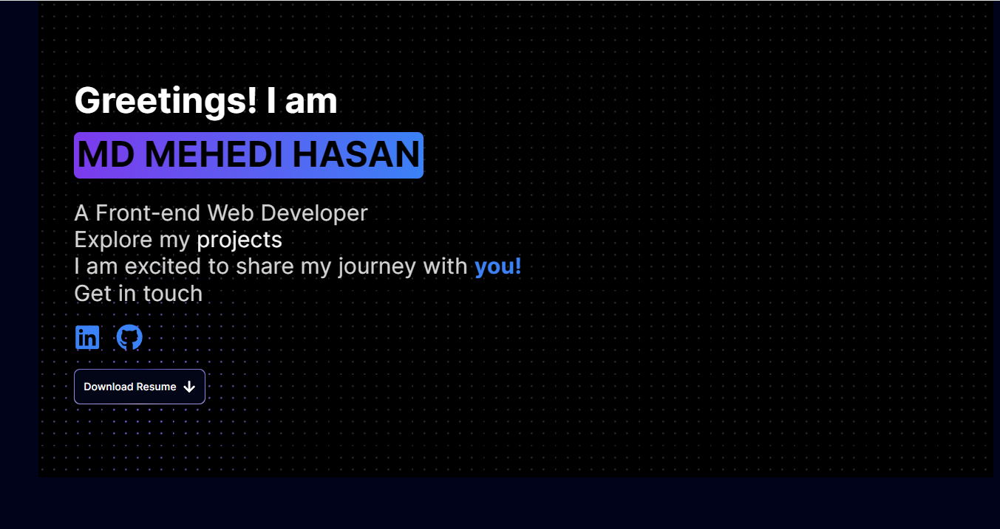

# Portfolio Website

This is Md Mehedi Hasan's portfolio website built with Next.js.

## Overview

This portfolio showcases Md Mehedi Hasan's skills, projects, and contact information.

## Technologies Used

- Next.js
- React
- CSS (tailwind)

## Features

- Responsive design
- Projects showcase
- Contact form

## Deployment

The website is deployed using Vercel and can be accessed at [Md Mehedi Hasan's Portfolio](https://mueid-portfolio.vercel.app).

## Screenshots



## Setup

1. Clone the repository:

   ```bash
   git clone https://github.com/MUEID11/your-portfolio-repo.git
   cd your-portfolio-repo
